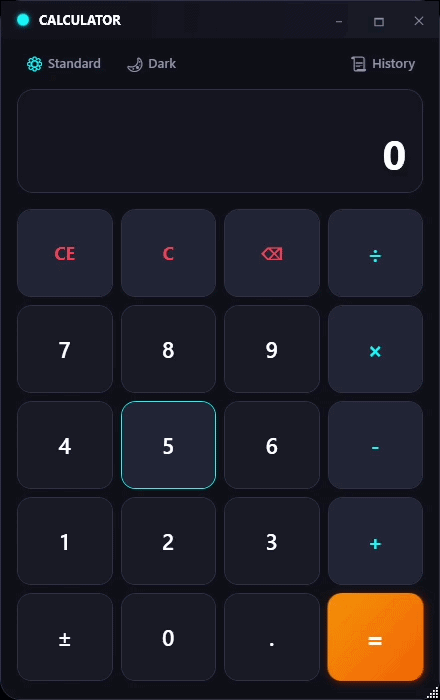
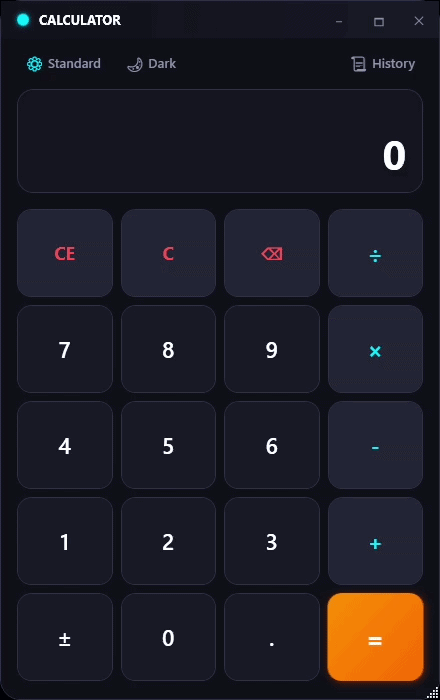
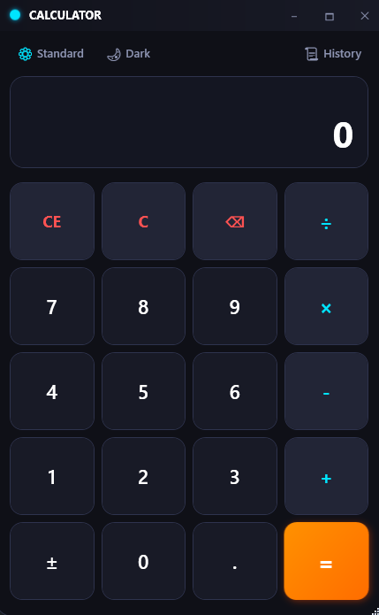

# 🧮 Modern WPF Calculator (MVVM & Clean Architecture)

[](https://github.com/Archi-arch/Modern-WPF-Calc)


A state-of-the-art desktop calculator built with **WPF (.NET 10)** leveraging the **MVVM** pattern and **Clean Architecture** principles. Features standard and scientific calculation modes, dynamic real-time theme switching (Obsidian Dark & Eye-Friendly Muted Slate Light), calculation history drawer, window resizing/maximization, and keyboard shortcuts.

---

## 📸 App Preview

<p align="center">
  
  
</p>

<p align="center">
  
</p>

---

## ✨ Key Features

- **🎨 Modern Glassmorphic Design & Real-Time Themes**:
  - **Obsidian Dark Theme**: High-tech neon cyan accents on deep obsidian glass background.
  - **Muted Slate Light Theme**: Soft, glare-free matte slate palette designed for eye comfort.
  - Real-time theme toggling without restarting the application.

- **🗂️ Dual Calculation Modes (Standard & Scientific)**:
  - **Standard**: Fundamental arithmetic operations (`+`, `-`, `×`, `÷`, `%`, `±`, `1/x`, `x²`, `√x`).
  - **Scientific**: Advanced functions including trigonometry (`sin`, `cos`, `tan`), logarithms (`ln`, `log`), factorials (`n!`), exponentiation (`x^y`), and mathematical constants (`π`, `e`).

- **📜 Interactive Calculation History**:
  - Slide-out history panel with one-click result selection to reuse past values.
  - Single-click history clearing.

- **📐 Responsive Window Resizing & Maximization**:
  - Window resizing support (`ResizeMode="CanResizeWithGrip"`).
  - Double-click header or click `🗖` button to toggle maximize/restore state.

- **⌨️ Keyboard Shortcuts & Focus Safety**:
  - Full support for Numpad and standard keybindings (`Enter`, `Escape`, `Backspace`, `+`, `-`, `*`, `/`).
  - Strict focus isolation (`Focusable="False"`) prevents keypress conflicts.

- **🛡️ Global Error Logging & Exception Safety**:
  - Unhandled exceptions are safely trapped and recorded into `error.log`.
  - User-friendly error messaging for invalid math inputs (e.g., division by zero, invalid roots).

---

## 🏛️ Architecture Overview

Built adhering to **Clean Architecture** and **MVVM** separation of concerns:

```
Calculator/
├── assets/                      # UI Screenshots & Demo GIFs (gif1.gif, gif2.gif, screenshot.png)
├── Core/                        # [Domain Layer - Pure Business Logic]
│   ├── Models/                  # CalculationItem Data Model
│   └── Services/                # CalculatorEngine, HistoryService, ThemeService
├── ViewModels/                  # [MVVM Layer - Presentation State & Commands]
│   ├── ViewModelBase.cs         # INotifyPropertyChanged Implementation
│   ├── RelayCommand.cs          # ICommand Wrapper
│   └── MainViewModel.cs         # UI State & Command Coordination
├── Converters/                  # WPF Value Converters
├── Styles/                      # XAML Dynamic Color Tokens & Style Templates
│   ├── Colors.xaml
│   └── Styles.xaml
├── App.xaml / App.xaml.cs       # Entry Point & Global Exception Dispatcher
└── MainWindow.xaml / .cs        # Custom Chrome Window & Keybinding Router
```

---

## 🚀 Quick Start

### Prerequisites:

- [.NET 10.0 SDK](https://dotnet.microsoft.com/download) or higher
- Visual Studio 2022 / JetBrains Rider / Visual Studio Code

### Installation & Run:

1. Clone the repository:
   ```bash
   git clone https://github.com/Archi-arch/Modern-WPF-Calc.git
   cd Modern-WPF-Calc/Calculator
   ```

2. Build and run the project:
   ```bash
   dotnet build
   dotnet run
   ```

---

## 📜 License

Distributed under the MIT License. See `LICENSE` for more information.
